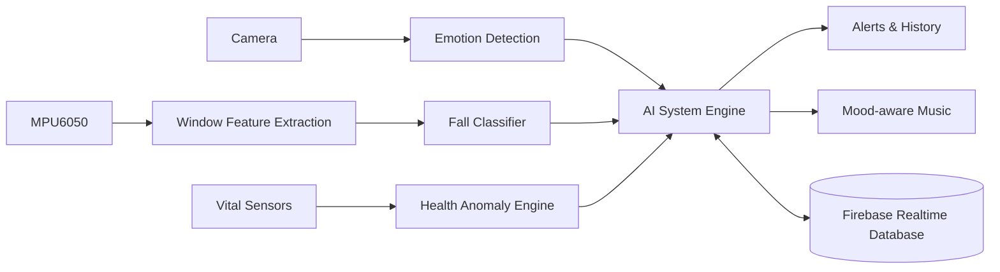

<div align="center">

# Smart Elderly Care

### AI-powered mood, fall, and vital-sign monitoring for safer independent living

[](https://www.python.org/)
[](https://opencv.org/)
[](https://www.tensorflow.org/)
[](https://firebase.google.com/)

**Computer vision · Machine learning · IoT sensor monitoring · Real-time alerts**

</div>

---

## Overview

Smart Elderly Care is a Python-based AI and IoT prototype designed to support
elderly people through continuous, non-invasive monitoring. It combines camera
emotion analysis, machine-learning fall detection, vital-sign anomaly checks,
Firebase synchronization, and mood-aware music playback in one modular system.

The application can run locally for demonstrations or connect to Firebase
Realtime Database for integration with Arduino and MPU6050-based hardware.

> [!IMPORTANT]
> This is an academic prototype for monitoring and early warning. It is not a
> certified medical device and must not be used to diagnose, treat, or replace
> professional medical care or emergency services.

## Core capabilities

| Module | What it does | Key technology |
|---|---|---|
| **Mood intelligence** | Detects facial emotion and accepts a result only after it remains stable | DeepFace, RetinaFace, OpenCV |
| **Fall detection** | Classifies engineered motion-window features as fall or no-fall | Random Forest, scikit-learn |
| **MPU6050 support** | Extracts features from recorded CSV data or live serial readings | NumPy, pandas, pyserial |
| **Vital monitoring** | Evaluates heart rate, SpO2, inactivity, and sensor validity | Rule-based anomaly engine |
| **Smart alerts** | Produces severity-aware events from combined health and fall signals | Central AI system engine |
| **Cloud integration** | Reads sensor streams and publishes AI results and history | Firebase Admin SDK |
| **Mood-aware audio** | Selects local music based on a stable detected emotion | pygame |

## System architecture



## Model performance

The completed fall-model evaluation reports:

| Metric | Result |
|---|---:|
| Test accuracy | **96.91%** |
| Fall recall | **98.69%** |

Training uses cross-validation on the training split, while the test split is
reserved for final evaluation. See
[`FALL_MODEL_RESULTS.md`](Elderly%20Care/elderly_care_ai/FALL_MODEL_RESULTS.md)
for the complete methodology and confusion-matrix results.

## Project structure

```text
Final Project Elderly Care/
├── README.md
├── Smart_Elderly_Completed_Final.pdf
└── Elderly Care/
    └── elderly_care_ai/
        ├── data/                       # Local datasets (ignored by Git)
        ├── models/                     # Trained model artifacts
        ├── music/                      # Emotion-based audio library
        ├── outputs/                    # Predictions and evaluation evidence
        ├── src/
        │   ├── alert_engine.py         # Alert prioritization
        │   ├── emotion_smoother.py     # Stable-emotion filtering
        │   ├── fall_model.py           # Fall classifier interface
        │   ├── firebase_client.py      # Realtime Database adapter
        │   ├── health_anomaly.py       # Vital-sign risk rules
        │   ├── mood_detector.py        # Background facial analysis
        │   ├── mpu6050_features.py     # Motion feature extraction
        │   ├── music_player.py         # Mood-aware playback
        │   └── system_engine.py        # Central orchestration
        ├── tests/                       # Automated unit tests
        ├── run_mood_detection.py
        ├── run_fall_detection.py
        ├── run_mpu6050_fall_detection.py
        ├── run_vitals_monitor.py
        └── train_fall_model.py
```

## Quick start

### Prerequisites

- Python 3.10 or newer
- A webcam for mood detection
- Git
- Optional: Firebase project and service-account credentials
- Optional: Arduino with MPU6050 or a compatible serial sensor stream

### 1. Clone and enter the application

```powershell
git clone https://github.com/amayarathnayake2001-wq/Elderly-Care.git
cd "Elderly-Care\Elderly Care\elderly_care_ai"
```

### 2. Create a virtual environment

```powershell
py -m venv .venv
.\.venv\Scripts\Activate.ps1
py -m pip install --upgrade pip
pip install -r requirements.txt
```

### 3. Configure the application

```powershell
Copy-Item .env.example .env
```

Local mood detection works without Firebase. To enable cloud integration, add
the Firebase credential path and database URL to `.env`.

### 4. Run mood detection

```powershell
py run_mood_detection.py
```

Press `q` in the camera window to stop the application.

## Configuration

| Variable | Default | Purpose |
|---|---:|---|
| `CAMERA_INDEX` | `0` | OpenCV camera device index |
| `CAMERA_WIDTH` | `640` | Capture width in pixels |
| `CAMERA_HEIGHT` | `480` | Capture height in pixels |
| `MIN_EMOTION_CONFIDENCE` | `40` | Minimum accepted emotion confidence |
| `EMOTION_STABILITY_SECONDS` | `4` | Required stable duration before publishing |
| `EMOTION_WINDOW_SIZE` | `15` | Number of recent emotion readings retained |
| `ANALYZE_EVERY_N_FRAMES` | `5` | Camera inference interval |
| `FIREBASE_CREDENTIALS_PATH` | empty | Service-account JSON path |
| `FIREBASE_DATABASE_URL` | empty | Firebase Realtime Database URL |
| `ELDERLY_ID` | `elderly_001` | Monitored person identifier |

## Usage

### Train the fall model

Place the labelled `Train.csv` and `Test.csv` files in `data/`, then run:

```powershell
py train_fall_model.py `
  --train-data data\Train.csv `
  --test-data data\Test.csv `
  --label-column fall `
  --tune
```

Generated model and evaluation files are written to `models/` and `outputs/`.
These directories intentionally keep generated artifacts out of Git.

### Predict a feature CSV

```powershell
py predict_fall_csv.py --input data\FEATURE_ROWS.csv
```

### Process raw MPU6050 recordings

The input columns must be `ax, ay, az, gx, gy, gz`.

```powershell
py run_mpu6050_fall_detection.py `
  --csv data\mpu6050_raw.csv `
  --window-size 100 `
  --step 50 `
  --acc-unit g
```

For live Arduino serial data:

```powershell
py run_mpu6050_fall_detection.py `
  --port COM3 `
  --baud-rate 115200 `
  --window-size 100 `
  --step 50 `
  --acc-unit g
```

### Monitor Firebase

```powershell
# Fall events
py run_fall_detection.py

# Heart rate and SpO2
py run_vitals_monitor.py
```

For a single polling cycle, add `--once`. The polling interval can be changed
with `--poll-seconds`.

### Run the simulators

```powershell
py simulate_sensor_data.py
py simulate_fall_monitor.py
py simulate_health_monitor.py
```

## Firebase data contract

The AI module publishes to the following paths:

```text
elderly/{elderly_id}/ai/mood
elderly/{elderly_id}/ai/fall
elderly/{elderly_id}/alerts/{alert_id}
elderly/{elderly_id}/history/mood/{record_id}
```

Hardware-generated movement windows must provide a `features` object containing:

```text
acc_max, gyro_max, acc_kurtosis, gyro_kurtosis, lin_max,
acc_skewness, gyro_skewness, post_gyro_max, post_lin_max
```

Publish the window under:

```text
elderly/{elderly_id}/sensors/movement/windows
elderly/{elderly_id}/sensors/movement/latest
```

Feature units, window duration, and sampling frequency must match the data used
to train the model.

## Testing

Run the automated test suite from `Elderly Care/elderly_care_ai`:

```powershell
pip install pytest
py -m pytest -q
```

Tests cover alert behavior, emotion smoothing, health anomalies, MPU6050 feature
extraction, system orchestration, and vital-monitor input handling.

## Security and privacy

- Never commit `.env`, Firebase service-account files, Wi-Fi credentials, raw
  health datasets, trained models, or generated patient records.
- Restrict Firebase Realtime Database access with authenticated security rules.
- Obtain informed consent before capturing faces or collecting health data.
- Minimize retained personal data and define an appropriate deletion policy.
- Keep human review and an independent emergency-contact process in the loop.

## Technology stack

`Python` · `OpenCV` · `DeepFace` · `TensorFlow` · `RetinaFace` ·
`scikit-learn` · `pandas` · `NumPy` · `Firebase Admin SDK` · `pygame` ·
`pyserial` · `pytest`

---

<div align="center">

Built as an academic AI & IoT project for safer, more responsive elderly care.

</div>
