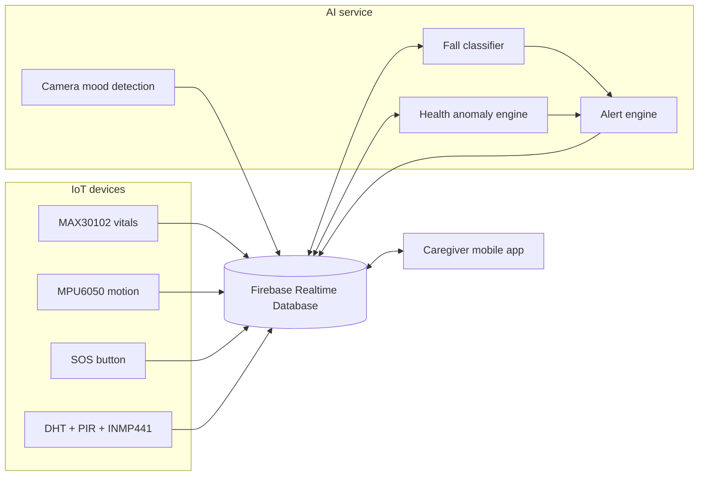

# Smart Elderly Care

An integrated elderly-safety monitoring prototype that connects an AI service,
a caregiver mobile application, and ESP32-based IoT devices through Firebase
Realtime Database.

> [!IMPORTANT]
> This is an academic prototype for monitoring and early warnings. It is not a
> certified medical device and must not replace professional medical care or
> emergency services.

## Project overview

The repository contains three main components:

| Component | Purpose | Main technologies |
|---|---|---|
| [Elder Care AI](elderly_care_ai/) | Detects mood and falls, evaluates vital-sign anomalies, creates alerts, and optionally plays mood-based music | Python, OpenCV, DeepFace, scikit-learn, Firebase Admin SDK |
| [Elder Care Mobile App](Elder%20Care%20Mobile%20App/) | Gives caregivers a live dashboard for health, mood, safety status, reports, and emergency alerts | React Native, Expo, React Navigation, Firebase |
| [Elder Care IoT](Elder%20Care%20IOT/) | Collects vital signs, motion, SOS, room temperature, humidity, and sound data | ESP32/ESP32-C3, MAX30102, MPU6050, DHT, PIR, INMP441, Arduino |

## System architecture



## Main features

- Facial-emotion detection with confidence and stability filtering
- Random Forest fall detection from motion-window features
- Heart-rate and SpO2 anomaly monitoring
- ESP32 sensor collection and Firebase synchronization
- Caregiver dashboard with live health, mood, and environmental readings
- Critical fall, SOS, and abnormal-health alerts
- Alert acknowledgement and patient summary reporting
- Mood-aware local music playback

## Repository structure

```text
Final Project Elderly Care/
|-- README.md
|-- elderly_care_ai/
|   |-- src/                 # AI, alert, Firebase, and audio modules
|   |-- tests/               # Python unit tests
|   |-- data/                # Local training/input data
|   |-- models/              # Generated model artifacts
|   |-- outputs/             # Evaluation and prediction output
|   |-- music/               # Audio grouped by emotion
|   |-- run_*.py             # Runtime entry points
|   `-- train_fall_model.py
|-- Elder Care Mobile App/
|   |-- screens/             # App screens
|   |-- navigation/          # Stack and tab navigation
|   |-- context/             # Shared live Firebase state
|   |-- services/            # Firebase configuration
|   |-- assets/              # App images and icons
|   `-- App.js
|-- Elder Care IOT/
|   |-- sensor_test.ino      # Vitals, movement, and SOS device
|   `-- Roombox_Monitor.ino.ino # Room environment monitor
`-- Smart_Elderly_Completed_Final.pdf
```

## Prerequisites

- Git
- Python 3.10 or newer
- Node.js and npm
- Expo Go or an Android/iOS emulator
- Arduino IDE with ESP32 board support
- A Firebase project with Realtime Database enabled
- A webcam for local mood detection
- Supported IoT hardware as required by each sketch

## 1. Elder Care AI

### Capabilities

The Python module provides camera-based mood detection, fall classification,
MPU6050 feature extraction, vital-sign risk rules, alert generation, Firebase
integration, and mood-aware music. The recorded fall-model evaluation reports
96.91% test accuracy and 98.69% fall recall. See
[FALL_MODEL_RESULTS.md](elderly_care_ai/FALL_MODEL_RESULTS.md) for details.

### Setup

```powershell
cd elderly_care_ai
py -m venv .venv
.\.venv\Scripts\Activate.ps1
py -m pip install --upgrade pip
pip install -r requirements.txt
Copy-Item .env.example .env
```

Set `FIREBASE_CREDENTIALS_PATH`, `FIREBASE_DATABASE_URL`, and `ELDERLY_ID` in
`.env` when Firebase integration is required. Mood detection can also run in
local-only mode with the Firebase values left blank.

### Run the AI services

```powershell
# Camera-based mood detection
py run_mood_detection.py

# Monitor Firebase movement windows
py run_fall_detection.py

# Monitor heart rate and SpO2
py run_vitals_monitor.py
```

Press `q` to close the mood-detection camera window. Add `--once` to either
Firebase monitor to perform a single polling cycle.

For raw MPU6050 CSV data (`ax, ay, az, gx, gy, gz`):

```powershell
py run_mpu6050_fall_detection.py --csv data\mpu6050_raw.csv `
  --window-size 100 --step 50 --acc-unit g
```

For a live serial stream:

```powershell
py run_mpu6050_fall_detection.py --port COM3 --baud-rate 115200 `
  --window-size 100 --step 50 --acc-unit g
```

### Train and test

```powershell
py train_fall_model.py `
  --train-data data\Train.csv `
  --test-data data\Test.csv `
  --label-column fall `
  --tune

py -m pytest -q
```

Generated models and reports are written to `models/` and `outputs/`.

## 2. Elder Care Mobile App

### Capabilities

The Expo application subscribes to `elderly/elderly_001` in Firebase and gives
caregivers access to:

- A live safety dashboard
- Heart rate, SpO2, temperature, humidity, and activity details
- AI mood results and confidence
- Emergency alerts with critical audio cues
- Alert acknowledgement and resolution details
- Patient reports, caregiver details, and elderly-person details
- Notification, emergency-call, privacy, and support settings

### Setup and run

```powershell
cd "Elder Care Mobile App"
npm install
npm start
```

From the Expo terminal, scan the QR code with Expo Go or launch a platform
directly:

```powershell
npm run android
npm run ios
npm run web
```

Before running the app against another backend, update
`Elder Care Mobile App/services/firebaseConfig.js` with that Firebase web-app
configuration. The current login and sign-up screens are prototype UI flows;
Firebase Authentication is not yet implemented.

## 3. Elder Care IoT

The IoT folder contains two Arduino sketches.

### Health, movement, and SOS device

`sensor_test.ino` targets an ESP32-C3 Super Mini and reads:

| Hardware | Data |
|---|---|
| MAX30102 | Heart rate, SpO2, IR/red readings, and sensor temperature |
| MPU6050 | Three-axis acceleration and gyroscope readings |
| Push button | SOS state |

The sketch uses GPIO 8/9 for the shared I2C bus and GPIO 3 for the SOS button.
It uploads the latest reading once per second to `/sensor_data/latest`.

Required Arduino libraries include `FirebaseClient`, `Adafruit MPU6050`,
`Adafruit Unified Sensor`, and the SparkFun MAX3010x sensor library.

### Room-box monitor

`Roombox_Monitor.ino.ino` targets an ESP32 and reads:

| Hardware | Connection/data |
|---|---|
| DHT11 | GPIO 4; room temperature and humidity |
| PIR sensor | GPIO 18; room movement |
| INMP441 microphone | WS 15, SCK 14, SD 32; sound level |

It uploads `Temperature`, `Humidity`, `Motion`, and `SoundLevel` once per
second to `/Roombox`.

### Upload a sketch

1. Install ESP32 board support and the required sensor/Firebase libraries in
   Arduino IDE.
2. Open the required `.ino` sketch.
3. Replace the example Wi-Fi and Firebase settings with your own configuration.
4. Select the correct ESP32 board and serial port.
5. Upload the sketch and open Serial Monitor at `115200` baud.

## Firebase integration

The three components exchange data through Firebase Realtime Database. The AI
module uses the following primary paths:

```text
elderly/{elderly_id}/ai/mood
elderly/{elderly_id}/ai/fall
elderly/{elderly_id}/ai/health
elderly/{elderly_id}/alerts/{alert_id}
elderly/{elderly_id}/history/mood/{record_id}
elderly/{elderly_id}/sensors/movement/latest
elderly/{elderly_id}/sensors/movement/windows
```

The current IoT sketches also publish their raw readings to:

```text
/sensor_data/latest
/Roombox
```

When integrating the hardware directly with the AI and app, map raw readings
into the shared `elderly/{elderly_id}/sensors/...` structure. Fall-detection
windows must contain these model-compatible features:

```text
acc_max, gyro_max, acc_kurtosis, gyro_kurtosis, lin_max,
acc_skewness, gyro_skewness, post_gyro_max, post_lin_max
```

The sampling rate, units, window duration, and feature names must match the
data used to train the fall model.

## Security and privacy

- Do not commit Wi-Fi passwords, Firebase secrets, service-account JSON files,
  `.env` files, patient records, or raw health datasets.
- Move device credentials into a local ignored configuration before deployment
  and rotate any credentials that have already been exposed.
- Require authenticated access in Firebase Realtime Database rules.
- Obtain informed consent before collecting face or health information.
- Keep a human caregiver and an independent emergency-contact process in the
  loop; never rely on this prototype as the only safety mechanism.

## Technology stack

`Python` · `OpenCV` · `DeepFace` · `TensorFlow` · `scikit-learn` · `Firebase`
· `React Native` · `Expo` · `Arduino` · `ESP32` · `MAX30102` · `MPU6050`

## License

No license file is currently included. Add a license before redistributing or
reusing the project outside its academic context.
